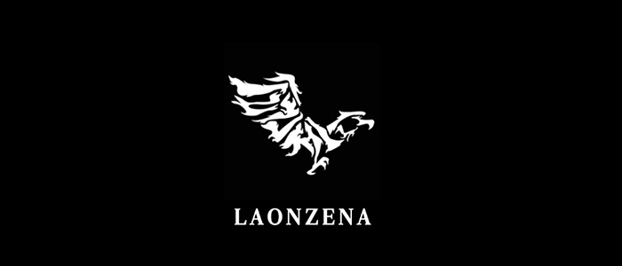

# 🥽 Unreal VR Laonzena OTT Project



> **"과거의 무대, 그 뜨거웠던 현장 속으로 — VR 실감형 댄스 공연 OTT 플랫폼"**
>
> *언리얼 엔진 5와 VR/HDR 기술을 활용하여 대학 시절 중앙 댄스동아리 'Laonzena'의 공연을 실제 무대 현장에서 감상하는 몰입형 가상현실 프로젝트입니다.*

---

## 📋 1. 프로젝트 개요 (Overview)

*   **프로젝트명:** Laonzena VR OTT
*   **장르:** VR 실감형 콘텐츠 / OTT 플랫폼 / 아카이브
*   **개발 인원:** 1인 개발 (원우)
*   **역할:** 기획, 디자인, 레벨 디자인, 애니메이션 리깅, 사운드, 서버 및 시스템 구현 등 **프로젝트 전 과정 단독 수행**
*   **개발 기간:** 2025.07 ~ 2026.02
*   **플랫폼:** Oculus Quest 2
*   **핵심 목표:**
  * **현장감의 재현**: 평면적인 영상 기록을 넘어, VR 기술을 통해 실제 공연이 이루어졌던 장소에서 무대를 다시 경험하는 몰입형 환경 구축.
  * **고품질 시각 구현**: HDR(High Dynamic Range)과 언리얼 엔진의 렌더링 기술을 결합하여 실제 무대 조명과 질감을 사실적으로 표현.
  * **개인적 기록의 자산화**: 대학 시절 댄스 동아리 'Laonzena'의 활동 기록을 디지털 트윈 공간과 결합한 고유 콘텐츠로 개발.
  * **언리얼 가상현실 개발 숙달**: Oculus를 사용한 가상현실 공간에서의 개발 환경 적응 및 학습.
---

## 🎥 2. 시연 영상 (Demo Video)


Uploading rockwithyou2 (1).mp4…


*VR 시연 버전은 화질이 많이 낮습니다. 양해 바랍니다.*

https://github.com/user-attachments/assets/0c66cf66-0e32-427b-852c-8267d9d6bbe5

---

## 🛠️ 3. 사용 기술 (Tech Stack)

### Engine & VR Strategy
*   **Unreal Engine 5.6**: Core Engine (최신 기능 활용)
*   **OpenXR / Oculus SDK**: VR 헤드셋 호환 및 상호작용 구현
*   **C++ & Blueprints**: 미디어 플레이어 제어 및 VR 인터랙션 시스템 구축

### Visual & Media
*   **HDR Rendering**: 실제 공연장의 화려한 조명 대비와 색감을 극대화
*   **Media Framework**: 고해상도 360도 및 일반 공연 영상 스트리밍/재생 시스템
*   **Spatial Audio**: 현장감을 극대화하는 공간 음향 시스템

---
## 🎮 4. 핵심 시스템 및 구현

### 4.1 VR 공간 선택 UI (Virtual Stage Selection UI)


* **역할**: 사용자가 VR 환경에서 'Laonzena' 무대 리스트를 확인하고 선택할 수 UI를 구현했습니다.
* **구현**:
   - VR Interaction: 레이 캐스팅(Ray Casting) 기반의 UI 상호작용을 통해 직관적으로 공연 장소를 이동할 수 있도록 설계했습니다.

### 4.2 실감형 미디어 재생 (Immersive Playback)


* **역할**: 단순히 영상을 띄우는 것이 아니라, 가상으로 재구성된 무대 위 스크린 혹은 360도 환경에 영상을 투사합니다.
* **구현**:
   - HDR 적용: 고대비 조명 연산을 통해 실제 공연장의 스포트라이트와 어둠의 대비를 생생하게 표현하여 현장감을 높였습니다.
   - Media FrameWork 적용: 언리얼 엔진의 Media Assets(Electra Player 등)를 활용하여 4K 이상의 고화질 공연 영상을 프레임 드랍 없이 재생했습니다. 특히 영상의 재생 상태를 VR UI와 동기화하고, 미디어 텍스처를 가상 공간 내 머터리얼과 연동하여 자연스럽게 투사되도록 구현했습니다.
   - 입체 음향 설계 : 단순한 스테레오 출력을 넘어, 사용자의 머리 방향(HMD Tracking)에 따라 소리의 방향과 거리감이 실시간으로 변하는 HRTF(Head-Related Transfer Function) 기술을 적용했습니다. 공연장의 리버브(Reverb)와 감쇄(Attenuation) 설정을 통해, 실제 넓은 강당이나 야외 무대에서 느끼는 현장감 있는 사운드를 재현했습니다.

### 4.3 로딩 시스템 (Seamless Level Transition)

https://github.com/user-attachments/assets/cfa14aa8-5916-4084-bf46-9564c10a58cd

* **역할**: 대용량의 공연장 맵과 고화질 영상 소스를 불러올 때 발생하는 화면 멈춤(Freezing) 현상을 방지하기 위해 비동기 로딩 방식을 채택했습니다.
* **구현**:
   - VR 전용 페이드 효과: 레벨 전환 시 급격한 시각 변화가 사용자에게 충격을 주지 않도록, 자체적인 맵 변경 PostVolume Material을 생성하여 연출을 통해 자연스러운 시점 이동을 구현했습니다.
   - 로딩 전용 가상 공간: 데이터 로딩 중에는 사용자를 미니멀한 가상 로비나 가이드 공간에 배치하여, 로딩 중에도 VR 환경의 몰입감이 깨지지 않도록 설계했습니다.

---

## 📚 5. 기술 문서 (Technical Docs)

### 5.1 VR 최적화 및 렌더링
* **고정 프레임 유지**: VR 멀미 방지를 위해 Instanced Stereo Rendering과 Variable Rate Shading을 활용하여 안정적인 프레임을 확보했습니다.
* **HDR 파이프라인**: 톤 매핑(Tone Mapping) 설정을 조정하여 VR 헤드셋 디스플레이 내에서 최적의 화이트 밸런스와 블랙 레벨을 유지하도록 커스터마이징했습니다.

### 5.2 미디어 동기화 로직
* **Media Texture 제어**: 미디어 에셋의 재생/정지/탐색 기능을 VR 컨트롤러와 바인딩하고, 대용량 영상 파일 로드 시의 프리징 현상을 방지하기 위해 비동기 로딩 방식을 채택했습니다.

---

## 📂 6. 프로젝트 구조 (Project Structure)

```
Project
├── Config/                # VR/프로젝트 환경 설정
├── Content/               
│   ├── Maps/              # 공연장(강당, 야외무대 등) 디지털 트윈 맵
│   ├── Media/             # 공연 영상 소스 및 미디어 플레이어 에셋
│   ├── Blueprints/        # VR Pawn, 인터랙션 시스템, OTT UI
│   ├── Materials/         # HDR 및 발광(Emissive) 머터리얼
│   └── VR_UI/             # VR 전용 위젯 인터페이스
├── Source/                
│   └── LaonzenaVR/        # 미디어 제어 및 VR 특화 C++ 클래스
└── Models/                # Blender 기반 무대 원본 모델링 파일
```

---

## 🐛 7. 트러블 슈팅 (Troubleshooting)

### 이슈 1: VR 환경에서의 HDR 노출 과다 (Blooming)
*   **문제**: 실제 공연장의 강한 조명을 재현하려다 보니 VR 헤드셋 내에서 과도한 눈부심(Bloom) 현상으로 시야가 방해됨.
*   **해결**: Post Process Volume에서 VR 전용 노출 보정(Auto Exposure) 범위를 제한하고, Bloom Intensity를 거리별로 감쇄시켜 시각적 편안함을 확보.

### 이슈 2: 대용량 영상 재생 시 프레임 드랍
*   **문제**: 4K 이상의 고화질 공연 영상을 재생할 때 렌더링 스레드 부하로 인해 프레임이 하락함.
*   **해결**: 영상 코덱을 최적화(H.264/H.265)하고, Media Plate 컴포넌트를 활용하여 프레임 안정화 성공.

### 이슈 3: 공간감과 영상의 이질감
*   **문제**: 2D 영상과 3D 가상 무대 사이의 깊이감 차이로 인한 이질감 발생.
*   **해결**: 영상이 재생되는 스크린 주변에 Reflection Capture를 배치하고 영상의 평균 색상을 주변 라이트와 실시간 연동하여(Ambient Light Sync), 영상의 빛이 가상 무대 장소에 반사되도록 연출.

---

*Contact: Wonwoo*
